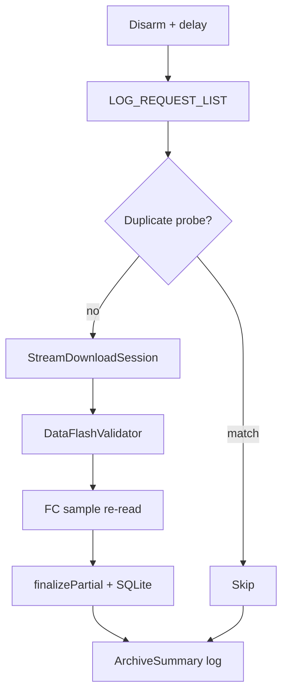

# Streaming Download + Integrity — Implementation Report

> Copyright (c) 2026 Angad Singh Bains. All rights reserved.

**Date:** 2026-06-26  
**Status:** Implemented (pending field benchmark on Pi + WFB)

---

## Executive Summary

mcls log download was refactored from **90-byte stop-and-wait** to **Mission Planner-style streaming**, with a layered integrity pipeline before durable persist and `LOG_ERASE`.

**Throughput target:** comparable to Mission Planner over the same telemetry path (measure with `benchmark_download = true` on hardware — no documented speed multipliers).

**Integrity target:** strongest verification compatible with standard MAVLink Log Transfer Protocol.

---

## Problem Statement

| Issue | Cause |
|-------|--------|
| Downloads took many minutes for ~6 MB logs | One `LOG_REQUEST_DATA` per chunk + blocking wait → one RTT per ~90 B on radio links |
| Verification was size-only | No structural parse, overlap detection, or FC cross-check |
| Operational debugging was hard | No per-archive summary or profiling mode |

---

## Architecture



### New components

| Component | File(s) | Role |
|-----------|---------|------|
| `MavlinkLogProtocol` | `include/mcls/MavlinkLogProtocol.hpp` | `kLogChunkSize`, alignment helpers |
| `StreamDownloadSession` | `StreamDownloadSession.{hpp,cpp}` | Streaming download + gap-fill + metrics |
| `ChunkCoverageTracker` | `ChunkCoverageTracker.{hpp,cpp}` | Slot bitmap + CRC32 fingerprints |
| `DataFlashValidator` | `DataFlashValidator.{hpp,cpp}` | Standalone `.bin` structural validation |
| `FcSampleOffsets` | `FcSampleOffsets.{hpp,cpp}` | 7 anchors + 57 random sample offsets |
| `ArchiveSummary` | `ArchiveSummary.{hpp,cpp}` | Structured performance log line |

---

## Streaming Download

### Before

```
LOG_REQUEST_DATA(90 B) → wait → LOG_REQUEST_DATA(90 B) → wait → ...
```

### After

```
LOG_REQUEST_DATA(count=0xFFFFFFFF) → FC streams LOG_DATA → write by offset
  → idle gap-fill for missing ranges → complete when ReceivedRanges full
```

### Key design decisions

| Decision | Choice | Rationale |
|----------|--------|-----------|
| Partial file sizing | Sparse grow-by-write | `ReceivedRanges` is source of truth; partial size reflects actual writes |
| Queue cap | 2048 messages | Absorb streaming bursts (~2048 × kLogChunkSize bytes) |
| Gap-fill idle | 500 ms default | Merged re-requests like MAVProxy |
| Chunk constant | `MAVLINK_MSG_LOG_DATA_FIELD_DATA_LEN` | Zero magic numbers |

---

## Integrity Pipeline

Run after stream session succeeds, before `StorageManager::finalizePartial`:

| Layer | Check | Failure reason |
|-------|--------|----------------|
| 0 | `ReceivedRanges` + chunk slot bitmap complete | `IncompleteDownload` / `VerificationFailed` |
| 1 | MAVLink CRC-16 per `LOG_DATA` (implicit in parser) | Retries via gap-fill |
| 2 | Incremental SHA-256 | Stored in SQLite |
| 3 | `validateDataFlashFile()` | `ParseFailed` |
| 4 | FC sample re-read (7 anchors + random) | `RereadMismatch` |
| — | Overlap conflict (same slot, different bytes) | `OverlapConflict` |

### FC sample anchors

| Anchor | Offset |
|--------|--------|
| File start | `0` |
| Early body | `kLogChunkSize` |
| First quarter | `alignDownToChunk(size/4)` |
| Midpoint | `alignDownToChunk(size/2)` |
| Third quarter | `alignDownToChunk(3*size/4)` |
| Penultimate | `alignDownToChunk(size - 2*C)` |
| Final | `alignDownToChunk(size - C)` |

Plus pseudo-random slots (deduped) to total `verify_fc_reread_sample_count` (default 64).

### Memory budget (overlap tracker)

For 16 MiB @ C=90:

- Chunk bitmap: ~23 KiB
- CRC32 fingerprint table: ~728 KiB (745,656 bytes)

---

## Configuration

New `[download]` keys in `config/config.toml`:

```toml
gap_fill_idle_ms = 500
max_queued_log_data = 2048
verify_dataflash_parse = true
verify_max_bad_header_ratio = 0.001
detect_overlap_conflict = true
verify_fc_reread = "sample"
verify_fc_reread_sample_count = 64
benchmark_download = false
```

See [configuration.md](../configuration.md) for full reference.

---

## Observability

### ArchiveSummary (always on)

Example log line:

```
ArchiveSummary log_id=3 size=6883200 duration_ms=14200 avg_kbps=483.2 duplicates=12 gap_fills=2 overlap_conflicts=0 parse=ok sample_reread=ok sha256=... decision=archived erase=no
```

### Benchmark mode (`benchmark_download = true`)

Periodic logs every 5 s: throughput, chunks, gap-fills, queue depth.

---

## Files Changed

### New

- `include/mcls/MavlinkLogProtocol.hpp`
- `include/mcls/ChunkCoverageTracker.hpp`
- `include/mcls/StreamDownloadSession.hpp`
- `include/mcls/DataFlashValidator.hpp`
- `include/mcls/FcSampleOffsets.hpp`
- `include/mcls/ArchiveSummary.hpp`
- `include/mcls/Crc32.hpp`
- `src/ChunkCoverageTracker.cpp`
- `src/StreamDownloadSession.cpp`
- `src/DataFlashValidator.cpp`
- `src/FcSampleOffsets.cpp`
- `src/ArchiveSummary.cpp`
- `src/Crc32.cpp`
- `tests/test_mavlink_log_protocol.cpp`
- `tests/test_fc_sample_offsets.cpp`
- `tests/test_dataflash_validator.cpp`
- `tests/test_chunk_coverage.cpp`

### Modified

- `src/LogDownloader.cpp` — streaming + verification orchestration
- `include/mcls/LogDownloader.hpp`
- `include/mcls/Types.hpp` — `ParseFailed`, `RereadMismatch`, `OverlapConflict`
- `include/mcls/Config.hpp`, `src/Config.cpp`
- `config/config.toml`
- `CMakeLists.txt`, `tests/CMakeLists.txt`
- `docs/architecture.md`, `docs/configuration.md`, `docs/protocol.md`
- `CHANGELOG.md`

---

## Testing

### Unit tests added

| Test | Coverage |
|------|----------|
| `test_mavlink_log_protocol` | `kLogChunkSize`, alignment |
| `test_chunk_coverage` | Overlap conflict, slot completion |
| `test_fc_sample_offsets` | Anchors, dedupe, determinism |
| `test_dataflash_validator` | FMT bootstrap, garbage rejection |
| `test_config` | New default keys |

### Field validation checklist (Pi + WFB)

1. Enable `benchmark_download`; compare avg KB/s to Mission Planner on same log
2. Throttle forwarder → gap-fill recovers; `ArchiveSummary` shows `gap_fills`
3. Corrupt partial → parse or sample re-read fails; `decision=failed`, no erase
4. Dedup probe skip works with streaming probe

---

## Preserved Behavior

- Cooperative cancellation on re-arm / new disarm
- Stall abort after `stall_abort_attempts`
- Conditional transport reconnect
- `LOG_REQUEST_END` RAII on archive cycle exit
- Durability ordering: partial → flush → rename → fsync → SQLite COMMIT → erase
- Probe dedup + full-file SHA-256 catalog semantics

---

## Known Limitations

1. **Throughput not benchmarked in CI** — requires Pi + WFB hardware run
2. **DataFlash parser is structural, not semantic** — validates message walk, not flight data correctness
3. **FC sample re-read is probabilistic** (except anchors) — `verify_fc_reread = "full"` available for maximum assurance at 2× download cost
4. **Full double-download mode** re-downloads via streaming session and compares SHA-256

---

## Recommendations

1. Run first field test with `benchmark_download = true` and compare to Mission Planner
2. Keep `verify_fc_reread = "sample"` as production default
3. Use `verify_fc_reread = "full"` only for high-assurance deployments
4. Consider future CLI wrapping `validateDataFlashFile()` for offline checks

---

See also: [architecture.md](../architecture.md) · [protocol.md](../protocol.md) · [durability.md](../durability.md)
